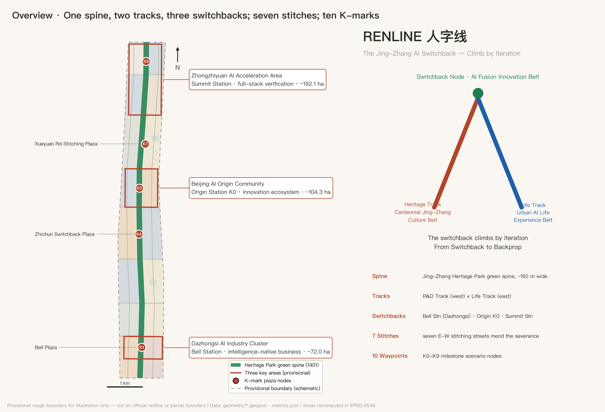
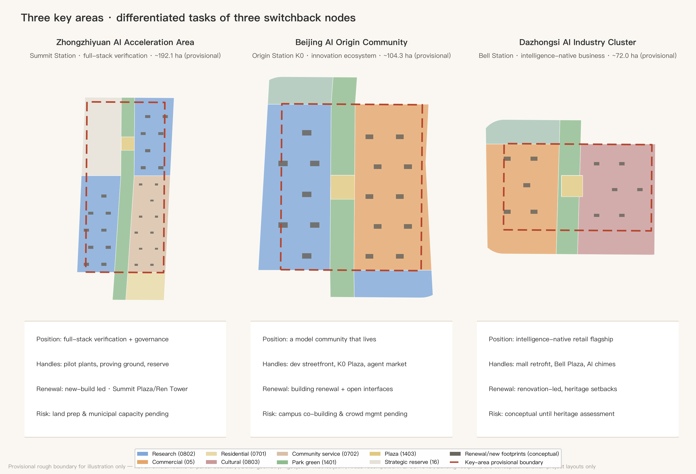
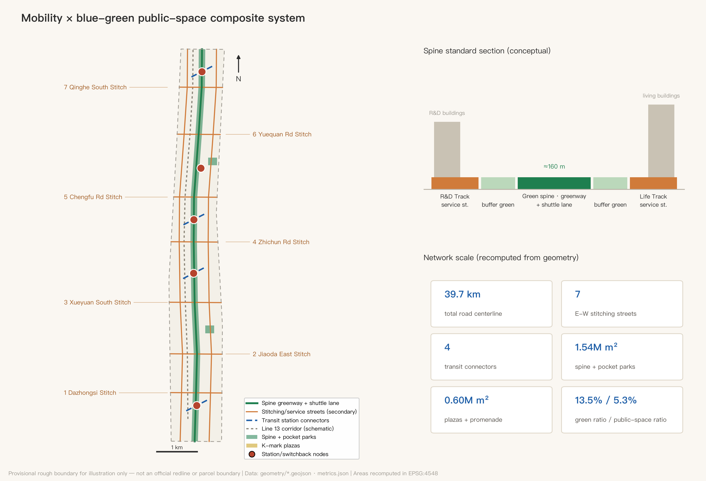
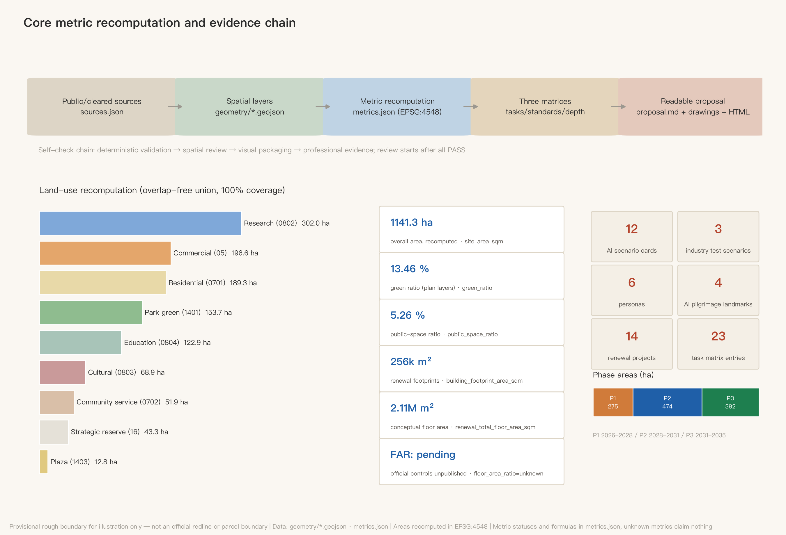

# RENLINE: An Urban Design Proposal for the Centennial Jing-Zhang AI Innovation Belt

> In 1909, Zhan Tianyou solved an impossible gradient at Badaling with a single "人"-shaped switchback: instead of forcing the climb, the train reverses — step back, change direction, climb again. That is precisely how artificial intelligence learns today: iterate, backpropagate, approximate. A century later, this proposal translates that switchback wisdom into the spatial and institutional prototype of the Jing-Zhang AI Innovation Belt, named **RENLINE (人字线)**. Of the two strokes of the character 人, one is the heritage track of the centennial railway, the other is the future track of urban AI life; where they meet is human-centered AI innovation.

## Design Basis and Source List

The primary basis of this proposal is the Pre-qualification Announcement for the International Solicitation of Urban Design Proposals for the Centennial Jing-Zhang AI Innovation Belt issued by the Haidian Branch of the Beijing Municipal Commission of Planning and Natural Resources [source:OFFICIAL-ANNOUNCEMENT] [standard:PROJECT-OFFICIAL-ANNOUNCEMENT]; the second basis is the excerpted taskbook of the open call for global AI agents [source:AGENT-TASKBOOK] [standard:PROJECT-AGENT-OPEN-CALL-TASKBOOK]. The three scope levels, three key areas, design tasks and required depth are taken from the announcement text; the three positioning statements, five functions, "three areas and two wings", the six mandatory agent tasks (agent.1–agent.6) and the unified boundary clause are taken from the taskbook. Before generation the agent read the machine-readable site package [source:SITE-PACKAGE], the public source registry [source:SOURCE-REGISTRY] and the maintainers' processed fact pack [source:PROCESSED-FACT-PACK], distinguishing formal-ready, background-only and provisional-only material: formal claims rely only on formal-ready sources; the provisional site boundary [source:BOUNDARY-SOURCE] and the rough key-area polygons [source:KEY-AREA-SOURCE] are provisional-only and are used solely for generation, display and self-checks — never as official redlines, precise areas or statutory controls.

Professional standards are read from the repository's local snapshots: the Urban Design Administration Measures [standard:MOHURD-URBAN-DESIGN-MEASURES], the Measures for Formulating and Approving Regulatory Detailed Plans [standard:MOHURD-CONTROL-DETAILED-PLANNING], and the Land Use and Sea Use Classification Guide for Territorial Spatial Planning [standard:MNR-LAND-USE-CLASSIFICATION-GUIDE]; the Building Engineering Design Document Depth Provisions are registered as a pending-official-file reference item [standard:MOHURD-ARCH-DESIGN-DEPTH-2016] and this proposal does not present it as a satisfied authority. The existing-conditions diagnosis depth item [depth:existing_conditions_diagnosis] carries the same disclosure: no official as-built, ownership or regulatory-control data was available; all existing-condition judgements derive from public common knowledge and are flagged for professional verification in `assumptions.json`.

The figure above doubles as the belt overview: dashed lines are the provisional rough boundary (never to be read as a redline), solid elements are design layers. The evidence chain works as follows: GeoJSON layers are the authoritative spatial data [data:geometry/site_boundary.geojson#SITE-001], metrics.json holds the authoritative indicators, the three matrices map tasks, standards and depth, and this text turns machine evidence into readable design judgement; figures and PDFs are presentation layers only.

## Three-Level Scope Framework

The proposal is organized strictly by the announcement's three scope levels [depth:three_level_scope_framework]: the coordinated research area of about 43.6 km² answers strategic questions of industrial ecosystem and future urban form; the overall design area of about 11.4 km² (the working extent of this package's `site_boundary`, recomputed as [metric:site_area_sqm]) delivers an urban renewal framework and regulatory-plan-level urban design; the key detailed-design area of about 368.4 ha contains the three key areas [metric:key_area_count] at implementation-plan depth. The three levels are one transmission chain, not three drawings: research-level judgements shape RENLINE's industrial and cultural positioning, the overall level casts them into the one-spine-two-tracks-three-switchbacks structure and land-use partition [data:geometry/land_use.geojson#LU-SPINE], and the key-area level tests parcels, buildings and scenarios at the three switchback nodes [data:geometry/key_areas.geojson#PROV-KEY-001].

It must be stated prominently: **all spatial boundaries in this package are provisional rough boundaries**. The overall design area uses the maintainers' polygon inferred from the announcement's verbal extents and approximate area [source:BOUNDARY-SOURCE], as do the three key areas [source:KEY-AREA-SOURCE]; their rectangular or polyline edges must not be read as road redlines or parcel boundaries. Once official redlines and key-area polygons are published, the site boundary, key areas, land use, roads, green space, public space, buildings, phasing and all area metrics (e.g. [metric:green_ratio], [metric:public_space_ratio]) must be recalculated as a whole package. This is an organizer-side data gap: it does not affect content review, but it limits the validity of precise area claims.

## Coordinated Research Area: Industry and Future City Research

**Master concept and naming system (agent.1).** Main name: **人字线 RENLINE**; English name: **RENLINE — The Jing-Zhang AI Switchback**. The naming logic has three layers: first, the switchback is the Jing-Zhang Railway's most globally recognizable engineering symbol — the 1909 spatial form of independent innovation; second, the switchback "climbs by iteration", structurally congruent with how AI learns through backpropagation, hence the English subtitle pairing Switchback with Backprop; third, the character 人 ("human") directly anchors the taskbook's human-centered governance principle — everything in an AI district is measured by the human scale. The naming system has three tiers: tier one is the RENLINE belt brand; tier two keeps the official area names (Zhongzhiyuan AI Acceleration Area, Beijing AI Origin Community, Dazhongsi AI Industry Cluster, Zhongguancun Technology Service Wing, Xiaoyuehe Scenario Empowerment Wing) with RENLINE station epithets — Zhongzhiyuan = "Summit Station", AI Origin Community = "Origin Station (K0)", Dazhongsi = "Bell Station"; tier three is the **K-mark milestone system**: ten milestone nodes K0–K9 along the Jing-Zhang Heritage Park green spine, numbered in homage to railway mileposts, each hosting an AI scenario or honor-display point. Logo direction: the character 人 abstracted as two converging rail lines with a dot above the junction (both signal light and neuron), the lines dissolving into data-stream dots at their ends; brand colors are signal green, rust red and compute blue. The visual system uses only open-licensed (SIL OFL) or commissioned typefaces — no uncleared fonts, images, trademarks or likenesses; the slogan is "百年折返,一线登顶 / Climb by Iteration". All of the above are brand directions for professional design teams to deepen [source:AGENT-TASKBOOK] [depth:overall_spatial_structure].

**Three positioning statements, five functions, and the three-areas-two-wings loop.** The two strokes and junction of 人 map directly onto the three positioning statements: heritage track = Centennial Jing-Zhang Culture Belt, life track = Urban AI Life Experience Belt, junction (switchback engine) = AI Fusion Innovation Belt. The five functions divide along the line: Zhongzhiyuan carries the full-stack independent innovation system and global AI governance voice (Summit Station); the AI Origin Community carries the world-class AI innovation ecosystem (Origin Station); Dazhongsi carries intelligence-native new business (Bell Station); the Zhongguancun Technology Service Wing is the western stroke (factor allocation and capital empowerment); the Xiaoyuehe Scenario Empowerment Wing is the eastern stroke (AI+ scenarios and a vibrant intelligent city). The collaboration loop is the "switchback cycle": the Origin Community produces models and talent → Zhongzhiyuan completes full-stack verification and governance output → Dazhongsi converts capability into consumption and business scenarios → the two wings feed factors and scenarios back to the origin, completing one full iteration.

**Global AI innovation ecosystem cases, 5–8 (agent.2).** Selection criteria: directly comparable railway-heritage regeneration or university-driven innovation, with publicly verifiable operating mechanisms. ① London King's Cross Knowledge Quarter: railway industrial heritage regeneration + DeepMind/Google headquarters + arts colleges — proof that a heritage corridor, AI headquarters and public space can reinforce each other; the most direct comparable for Jing-Zhang. ② Station F, Paris: a disused rail hall converted into the world's largest startup campus — proof that a single railway building can host a thousand-team innovation community; maps to Dazhongsi's stock conversion. ③ Kendall Square, Boston: MIT-driven "most innovative square mile" — proof of the research density unleashed when campus walls open; maps to the Xueyuan Road university open belt. ④ one-north, Singapore: twenty years of rolling planning and a government platform operator — maps to Zhongzhiyuan's implementation mechanism. ⑤ Mission Bay/SoMa, San Francisco: hospital-lab-startup mixed districts — proof that a "lived-in innovation district" beats a pure park; maps to the Origin Community. ⑥ Yuehai Subdistrict, Nanshan, Shenzhen: world-class companies grown inside high-density existing fabric — maps to Zhichun Road's building-stock renewal. The transferable mechanisms of all six cases land in the land-use, public-space and operations chapters below [source:AGENT-TASKBOOK] [standard:PROJECT-AGENT-OPEN-CALL-TASKBOOK].

**Future urban form judgement.** An urban form fit for AI-era productivity is not "park + towers" but three shifts: from parcels to corridors (innovation distributed continuously along the green spine [data:geometry/green_space.geojson#GS-SPINE]); from walls to interfaces (the edges of universities, institutes and communities become exchange frontages); from functional zoning to scenario layering (the same space tests by day and lives by night). The research land of [metric:land_use_research_area_sqm], commercial land of [metric:land_use_commercial_area_sqm] and education land of [metric:land_use_education_area_sqm] arranged along the spine are this judgement in spatial form. Regionally, RENLINE connects north via Qinghe Station toward Huairou Science City and Future Science City, south via the Xizhimen hub to the central city, and east-west via its two wings to the Jingzang Expressway innovation corridor and Zhongguancun Street — the middle-section engine of Haidian's "three areas and two wings" and Beijing-Tianjin-Hebei collaboration (conceptual suggestion pending professional deepening).

## Overall Design Area: Urban Renewal and Regulatory-Plan-Level Urban Design

The overall spatial structure is **"one spine, two tracks, three switchbacks; seven east-west stitches; ten K-mark waypoints"** [depth:overall_spatial_structure]: the spine is the Jing-Zhang Heritage Park green spine, a continuous corridor about 160 m wide running the full belt [data:geometry/green_space.geojson#GS-SPINE]; the two tracks are the R&D Track (west, research-led) and the Life Track (east, living-led), carried by two north-south service streets [data:geometry/roads.geojson#RD-NS-W]; the three switchbacks are the innovation engine nodes at Dazhongsi, Zhichun/Origin and Zhongzhiyuan; the seven stitches are seven east-west stitching streets, each mending the century-old severance caused by the rail corridor [metric:stitch_street_count]; the ten waypoints are the K-mark scenario nodes along the spine.

The renewal framework is "stock first, increment as accent": the southern section (Dazhongsi–Jiaotong University) is led by conversion of existing assets (intelligence-native retrofit of the existing Dazhongsi commercial complex), the middle section (Zhichun–Origin) by building renewal and interface opening, the northern section (Zhongzhiyuan) by new construction plus strategic reserve land [metric:land_use_reserved_area_sqm]. The renewal project list totals [metric:renewal_project_count] items (see the phasing chapter). In functional structure, research land is about 3.02 M m², commercial services about 1.97 M m², residential about 1.89 M m² ([metric:land_use_residential_area_sqm]), education about 1.23 M m² — "research as the frame, life as the base, consumption as the face"; these shares are conceptual and must be checked against regulatory-plan conditions when published [standard:MOHURD-CONTROL-DETAILED-PLANNING].

Development intensity and height/massing [depth:development_intensity_controls] [depth:height_massing_character]: official FAR, height, density, green-ratio and setback controls were not released with the solicitation, so all are treated as **pending regulatory conditions** — no fabricated approved values. The conceptual intensity gradient is "low at the spine, higher at the edges": predominantly mid-rise within 200 m of the spine, stepping up outward, with the single urban high-point argued only around Zhongzhiyuan's Summit Plaza (subject to aviation, landscape and heritage sightline studies). The conceptual renewal floor area is about 2.11 M m² [metric:renewal_total_floor_area_sqm] on footprints of about 256,000 m² [metric:building_footprint_area_sqm], carried by 167 conceptual building footprints from [data:geometry/buildings.geojson#BLDG-001]; the project footprint density [metric:building_density] counts renewal projects only, not the belt's existing stock. Urban character runs in three sections — "Garden" north, "Campus" middle, "City" south — detailed in the character chapter [standard:MOHURD-URBAN-DESIGN-MEASURES].

The Jing-Zhang Heritage Park vitality belt is the hub of the framework: the spine is not buffer greenery but the belt's public living room and scenario corridor; all ten K-marks sit on or beside it [data:geometry/public_space.geojson#PS-PROM], with [metric:public_space_area_sqm] of public space supporting daily exchange and event operations. Transport, rail and municipal frameworks follow in their chapter; the innovation indicator system follows in the metrics chapter.

## Detailed Design of Key Areas

All three key areas are designed on provisional polygons [data:geometry/key_areas.geojson#PROV-KEY-002] as directional detailed designs [depth:three_key_area_detailed_design]; boundary precision limits everything below to "positioning + structure + project handles" — parcel-level conclusions await official redlines and regulatory conditions.

**Zhongzhiyuan AI Acceleration Area (Summit Station, ~192.1 ha).** Positioning: the integration and verification ground of the full-stack independent innovation system, and the global dialogue venue for AI governance. Structure: the southern zone hosts the full-stack innovation area (pilot-scale verification facilities across chips–frameworks–models–applications, mostly new construction [data:geometry/land_use.geojson#LU-GW]); about 433,000 m² of strategic reserve is held along the Fifth Ring for future global AI institutions; the eastern side hosts the innovation service area (talent apartments, international community services). Buildings: new-build dominated, using reconfigurable large-floor-plate lab and pilot-line prototypes. Transport: the Qinghe-direction connector links the high-speed rail hub; Summit Plaza is the northern gateway. AI scenarios: the embodied-robot proving ground and the northern leg of the autonomous shuttle. Risks: greenfield development depends on land preparation and municipal capacity studies — all pending confirmation.

**Beijing AI Origin Community (Origin Station, ~104.3 ha).** Positioning: the everyday habitat of a world-class AI ecosystem — not a park, but a "model community that lives". Structure: the Tsinghua-East AI Origin research area on the west (campus-city interface), the Wudaokou intelligent consumption area on the east (youth night economy), anchored by K0 Origin Plaza at the center [data:geometry/public_space.geojson#PS-PLZ-3]. Buildings: mostly building renewal with limited new construction, the priority being to convert all street-level frontages into developer-friendly interfaces (desks, demo stages, markets). Transport: the Wudaokou station connector and Chengfu Road stitching street open the east-west link. AI scenarios: the agent marketplace, the developer streetfront, night-economy governance. Risks: opening campus edges requires university co-building mechanisms; peak crowd management needs coordination with metro operations.

**Dazhongsi AI Industry Cluster (Bell Station, ~72.0 ha).** Positioning: the flagship showcase of intelligence-native business — the prototype of AI-era "going shopping". Structure: the intelligent consumption renewal area west (conversion of the existing large-format commercial complex), the cultural display area east organized around the Dazhongsi (Juesheng Temple) [data:geometry/constraints.geojson#CON-HERITAGE-DZS], joined by Bell Plaza. Buildings: renovation-dominated, with strict height and massing control near the heritage site; only low-intensity, set-back design inside the concern zone (statutory protection extents per the heritage authority). Transport: the Line 13 Dazhongsi TOD stitching street; the North Third Ring is the southern gateway. AI scenarios: the city-scale AI health check and the AI chime co-creation. Risks: pending the heritage impact assessment, everything near the monument stays conceptual [data:geometry/land_use.geojson#LU-AE].

## AI Innovation Ecosystem, Personas, and AI+ Scenarios

**Six personas ([metric:persona_count], agent.3).** ① AI researchers/PhD students: need labs and late-night canteens within a ten-minute circle; pain points are commuting and housing cost. ② Founders and independent developers: need cheap desks, compute vouchers and demo exposure; pain point is connection efficiency with big tech and universities. ③ Industry engineers: need test scenarios and pilot facilities; pain point is approval cycles. ④ Original residents and elders: need renewal without displacement and accessible services; pain points are the digital divide and construction disturbance. ⑤ Teenagers and families: need touchable AI education and safe public space. ⑥ International visitors and business travelers: need multilingual accessibility and quality MICE facilities. Each persona maps to space: ①→Origin research area and talent apartments; ②→developer streetfront and marketplace; ③→Zhongzhiyuan proving ground; ④→Beixiaguan and Zaojunmiao livability belts [data:geometry/land_use.geojson#LU-BE]; ⑤→K-mark science waypoints on the spine; ⑥→Summit Plaza convention belt.

**Twelve AI scenario cards ([metric:scenario_card_count]), of which three are industry test-and-verification scenarios ([metric:industry_test_scenario_count]).** Each card is organized by six elements — location / users / operating data / privacy boundary / human review / operator — and every spatial anchor is locatable in the layers:

| # | Scenario card | Spatial anchor | Users | Privacy boundary & human review |
| --- | --- | --- | --- | --- |
| T1 | Green-spine autonomous shuttle (test) | Greenway service lane K2–K8 | Commuters/visitors | No facial capture; anonymized trajectories; safety steward on board, human takeover |
| T2 | Embodied-robot open proving ground (test) | Enclosed site, Zhongzhiyuan south | Industry engineers | Testing inside enclosure; livestreams blurred; ethics-board admission |
| T3 | Municipal-asset AI health check (test) | Dazhongsi existing blocks | Municipal operators | Asset-state data only; no personal data; work orders signed by humans |
| 4 | K-mark AR history layer | K0–K9 milestones | Visitors/teens | On-device rendering, no image upload; content vetted by historians |
| 5 | Developer streetfront | Origin Community frontages | Developers | Real-name booking, anonymous display; aggregated business data public |
| 6 | Multilingual AI guide & accessibility copilot | Belt-wide greenway and stations | International/disabled visitors | On-device speech; explainable routing; human fallback |
| 7 | Community elder-care AI companion | Beixiaguan renewal area | Elders | Informed consent; emergency-only reporting; family + social-worker double review |
| 8 | Campus-industry internship agent matching | Xueyuan Road open belt | Students/companies | Students own their résumés; explainable matches; humans decide hiring |
| 9 | Night-economy intelligent governance | Wudaokou consumption area | Merchants/residents | Aggregated footfall and noise only; measures via district consultation |
| 10 | Agent marketplace | K0 Origin Plaza | Developers/public | Listed agents registered and reviewed; disputes arbitrated by humans |
| 11 | Ecological sensing & bird-friendly lighting | Full spine | Ecology/all | Environmental sensing only; lighting strategy peer-reviewed by ecologists |
| 12 | AI chime co-creation | Dazhongsi cultural area | Visitors/musicians | Bell samples require museum authorization; AI participation labeled |

The three test scenarios (T1–T3) come with a "scenario opening mechanism": a fast-track test permit channel, insurance and liability templates, a data-minimization checklist and public incident reporting. All scenarios obey the taskbook's prohibitions — no automated decisions that cannot be humanly reviewed, no reliance on non-public data or designated vendors, and test scenarios are never described as approved operations [source:AGENT-TASKBOOK]. In the ecosystem map, scenario cards are the application layer, joined to the R&D Track's model layer, Zhongzhiyuan's verification layer and the two wings' factor layer, all threaded by the street and slow-mobility network of [metric:road_centerline_length_m].

## Land Use, Building Scale, and Retain-Renovate-Demolish Strategy

The land-use layout [depth:land_use_layout] follows the national territorial land classification [standard:MNR-LAND-USE-CLASSIFICATION-GUIDE], partitioning the overall area into 24 design cells: the green spine (1401 park green, about 1.537 M m², [metric:green_space_area_sqm]) runs down the center; five plaza cells (1403) anchor the switchback and stitching nodes; the flanks carry research (0802), commercial (05), residential (0701), education (0804), cultural (0803), community-service (0702) and reserved (16) land by segment. All polygons share cut edges with zero gaps and zero overlaps, fully recomputable [data:geometry/land_use.geojson#LU-EW]. Areas by class: research 3.020 M, commercial 1.966 M, residential 1.893 M, education 1.229 M, cultural 0.689 M, community service 0.519 M, green 1.537 M, plaza 0.128 M, reserved 0.433 M m².

The retain-renovate-demolish strategy [depth:retain_renovate_demolish] differentiates by section: south (Dazhongsi, Jiaotong University) **renovation-led** — footprints marked renovate are functional conversions of existing facilities, never the monument itself; middle (Zhichun, Origin) **retain + renovate** — residential belts wholly retained, acupuncture renovation along frontages and buildings; north (Zhongzhiyuan) **new-build-led** plus strategic reserve. The belt has **no area-wide demolition**: any demolish-grade action requires prior ownership, resettlement and heritage assessment, and this proposal draws no parcel-level demolition conclusions (a taskbook prohibition). The conceptual floor area of ~2.11 M m² and the storey assumptions (research 9F / commercial 12F / residential 6F / education 5F / cultural 3F / service 4F) are registered in `assumptions.json`; statutory intensity indicators such as FAR remain unknown pending regulatory conditions [standard:MOHURD-CONTROL-DETAILED-PLANNING] [depth:metrics_recalculation]. Space supply: reconfigurable large floor plates for research, "show-store hybrids" for consumption, dual-track housing (talent apartments + stock upgrading); operations are covered in the long-term operations chapter.

## Transport, Rail, Municipal Infrastructure, and Public Services

The core transport move [depth:traffic_rail_slow_parking] is **stitching**: seven east-west stitching streets [data:geometry/roads.geojson#RD-EW-1] mend the rail corridor's century-old severance (Dazhongsi, Jiaoda East, Xueyuan South, Zhichun, Chengfu, Yuequan and Qinghe South — [metric:stitch_street_count]); two north-south service streets carry motor traffic for the R&D and Life Tracks; inside the spine only the slow-mobility greenway and the autonomous shuttle lane run. Total road centerline length is about 39.7 km [metric:road_centerline_length_m]. Rail integration: the Line 13 corridor is an existing constraint [data:geometry/constraints.geojson#CON-RAIL-13] (schematic only — actual alignment per official data); Dazhongsi, Zhichunlu and Wudaokou stations get TOD connectors [data:geometry/roads.geojson#RD-TC-1], with the northern end linking toward the Qinghe hub; station plazas double as stitching plazas, with transfer-distance targets left to detailed design. Parking and cycling: renewal-project parking minima await regulatory conditions; shared-bike and shuttle interchange bays line the spine, and car parking concentrates underground and at the belt edges (conceptual).

Municipal and new infrastructure [depth:municipal_new_infrastructure]: conventional municipal capacities (water, drainage, power, gas, heat) have no official data and are all listed as pending items with no professional-calculation claims. Four conceptual new-infrastructure strategies: ① a photovoltaic canopy + distributed storage demonstration section along the spine; ② edge-compute waypoints (low-latency compute embedded in K-mark nodes, supporting cards T1/4/6); ③ a belt-wide unified urban sensing base (environment and asset state, no human-image capture); ④ open data interfaces and a digital-twin base for agent-facing services (co-built with city governance bodies). Public services: the innovation service platform sits in Zhongzhiyuan's service area [data:geometry/land_use.geojson#LU-GE]; talent life services (international school, clinics, long-term rentals) dot the Life Track; 15-minute-circle coverage is a target value pending population and facility studies.

## Blue-Green Network, Public Space, and Urban Character

The blue-green system [depth:blue_green_public_space] takes the Jing-Zhang Heritage Park green spine as its trunk ([metric:green_ratio] recomputes the plan's green ratio at about 13.5% — plan layers only, excluding other existing greenery), with two pocket parks (Zaojunmiao, Xueqing Road) adding community-level green [data:geometry/green_space.geojson#GS-PKT-1]; links north to the Qinghe River and east to the Xiaoyue River are conceptual directions (both outside this package's boundary, to be deepened at research level). The public-space system pairs the spine promenade (composite with the greenery) with five plazas ([metric:public_space_ratio] ≈ 5.3%): Bell Plaza, Zhichun Switchback Plaza, K0 Origin Plaza, Xueyuan Road Stitching Plaza and Summit Plaza [data:geometry/public_space.geojson#PS-PLZ-5] — at once K-mark anchors and event stages.

**AI public space and pilgrimage landmarks (agent.4, [metric:ai_landmark_count]).** ① **The K0 Origin Stone** (K0 Origin Plaza): China's AI "kilometre zero" — a physical monument with a dynamic honor wall scrolling the names of open-source model, dataset and paper contributors (listed only with personal consent and open-license compliance). ② **The Ren Tower** (Summit Plaza): an observation tower of two converging tracks housing a global AI milestone timeline, its top looking north toward the Yanshan range — the direction the railway once had to conquer. ③ **The Bell Museum × AI Chimes** (Dazhongsi): centennial bells meet generative music; every major open-source release rings the bell — the stock-exchange bell translated into open-source ritual. ④ **The Switchback Bridge** (Zhichun Switchback Plaza): a footbridge over Line 13 engraved with authorized landmark code fragments and paper citations. The honor system = K-mark milestones + contributor register + the annual "Ren Prize". The public-space component library: powered developer benches, demo steps, bookable display windows, edge-compute waypoints, AR markers. All landmarks are conceptual; heritage, greenery and traffic-safety constraints prevail; none is presented as approved construction [standard:MOHURD-URBAN-DESIGN-MEASURES].

**Cultural narrative (agent.5).** RENLINE's cultural structure is a triple overlay: Centennial Jing-Zhang (Zhan Tianyou, the switchback, self-reliant engineering) × Zhongguancun (going to sea, garages, open source) × new AI culture (human-machine co-creation, agents, open science). Spatially, the south speaks "Bells" (the time-sense of industrial and commercial civilization), the middle speaks "Origin" (every departure), the north speaks "Summit" (climb and switchback). The wayfinding system builds on K-marks, the 人-shaped arrow and the three-color track lines; typefaces are custom variants of open-licensed families; any use of historical imagery or railway artifacts requires archive authorization. The international narrative is **"From Switchback to Backprop: one line, two ascents"** — in 1909 China climbed Badaling with a switchback; in 2026 Chinese AI climbs the intelligence summit by iteration on the same line — placing RENLINE in dialogue with King's Cross, Station F and the world's railway-heritage innovation districts [source:AGENT-TASKBOOK]. The urban keynote: rust red (heritage) + signal green (ecology) + compute blue (technology); architectural character guidelines await professional deepening.

## Renewal Projects, Implementation Policy, and Phasing

The renewal list holds 14 projects [metric:renewal_project_count] [depth:renewal_project_list] in three phases [depth:phasing_implementation] [data:geometry/phasing.geojson#PHASE-1]:

**Phase 1 (2026–2028, southern double-stitch launch, ~2.75 M m² [metric:phase1_area_sqm]):** ① intelligence-native retrofit of Dazhongsi's existing commercial complex; ② Bell Plaza and museum interface opening; ③ the Dazhongsi TOD stitching street; ④ the Jiaoda East stitching street and under-viaduct activation; ⑤ the southern spine connection. **Phase 2 (2028–2031, middle switchback engine, ~4.74 M m² [metric:phase2_area_sqm]):** ⑥ Zhichun research building renewal; ⑦ K0 Origin Plaza and the Origin Stone; ⑧ the Wudaokou station-front smart district; ⑨ the middle spine and both pocket parks; ⑩ the Switchback Bridge. **Phase 3 (2031–2035, northern summit, ~3.92 M m² [metric:phase3_area_sqm]):** ⑪ the Zhongzhiyuan full-stack innovation area; ⑫ Summit Plaza and the Ren Tower; ⑬ the Xueyuan Road "open the walls" program; ⑭ the strategic reserve starter area. Policy suggestions (all conceptual): urban-renewal-ordinance pathways for stock conversion; campus-city co-building agreements with operating concessions for university edges; regulatory sandboxes for test scenarios; a "headquarters reserve + triggered activation" mechanism for the reserve land. Public participation: plan disclosure and community co-creation workshops each phase; "renewal without displacement" as a project precondition.

**Annual event system and long-term operations (agent.6).** Events: the annual **RENLINE Summit** (a global AI open-source conference at Summit Plaza and the Ren Tower), quarterly **Switchback Days** (demo days at K0 Plaza), the **Jing-Zhang AI Marathon** (the full spine — a tech-plus-sport city IP), and the **Bell Ceremony** (major open-source releases at Dazhongsi). Developer community: RENLINE chapters (models, embodiment, scenarios, governance), K-mark nodes as offline bases, contribution points redeemable for honor-wall placement and desk privileges. Scenario operations: the scenario-voucher system (application → district review → insurance filing → public reporting), with test revenues reinvested in public-space maintenance. International transmission and conversion: sister-innovation-belt agreements with King's Cross, Station F and one-north; the Summit's Global Switchback Prize channels winning teams toward the reserve-land landing track. Long-term brand assets (RENLINE, the K-mark system, the Ren Prize, the marathon) are held and operated by the district platform company. All events, policies, funding and investment-attraction arrangements are conceptual suggestions, not confirmed government arrangements [source:AGENT-TASKBOOK].

## Metrics, Area Recalculation, and Compliance Matrix

All spatial indicators are recomputed from GeoJSON in EPSG:4548 [depth:metrics_recalculation], consistent with `metrics.json` and with the HTML display. The design meaning of each core indicator: overall area [metric:site_area_sqm] (~1,141 ha, provisional recomputation); green area [metric:green_space_area_sqm] and green ratio [metric:green_ratio] (13.5% — continuous everyday green accessible to talent, not token landscaping); public-space area [metric:public_space_area_sqm] and ratio [metric:public_space_ratio] (5.3%, sustaining innovation-exchange density); renewal footprints [metric:building_footprint_area_sqm] and project density [metric:building_density] (renewal intensity, not existing density); conceptual floor area [metric:renewal_total_floor_area_sqm] (2.11 M m², underpinning industrial space supply); network length [metric:road_centerline_length_m] (the stitching and slow-mobility total); the five land-structure indicators ([metric:land_use_research_area_sqm], [metric:land_use_commercial_area_sqm], [metric:land_use_residential_area_sqm], [metric:land_use_education_area_sqm], [metric:land_use_reserved_area_sqm]) jointly express the "research as frame, life as base" structure; the three phase areas ([metric:phase1_area_sqm], [metric:phase2_area_sqm], [metric:phase3_area_sqm]) match the project list; and the task-quantity indicators ([metric:scenario_card_count]=12, [metric:industry_test_scenario_count]=3, [metric:persona_count]=6, [metric:ai_landmark_count]=4, [metric:renewal_project_count]=14, [metric:stitch_street_count]=7, [metric:key_area_count]=3) match the taskbook's hard requirements. FAR is unknown: official controls are unpublished and no calculation is claimed.

`compliance_matrix.json` covers all announcement tasks 1.3/1.4/1.5 plus agent.1–agent.6 — 23 entries, each with section, layer, metric, drawing, HTML and source evidence; `standard_matrix.json` covers the six registered standards; `design_depth_matrix.json` marks all fifteen depth items complete, with items touching official controls or as-built data expressed as "conceptually complete + pending-confirmation list" [depth:risk_missing_data].

## Risk, Copyright, and Compliance

**Data and boundary risk.** All boundaries in this package are provisional, flagged repeatedly in `sources.json`, `assumptions.json`, `self_check.json`, the visual page and this text; five data gaps are registered item by item [depth:risk_missing_data] — official redlines, regulatory controls, as-built and ownership data, municipal capacities, statutory heritage extents — and publication of any one triggers recalculation of the affected layers and metrics. **Copyright and authorization.** Text, figures and GeoJSON are original AI-agent output; the six international cases cite public facts only; any physical display of historical imagery, museum bell samples, personal names, code or papers is conditional on authorization or open-license compliance — unauthorized means unused; the logo and wayfinding are direction descriptions using no existing typeface or trademark assets; see `report/copyright_statement.md`. **AI ethics and privacy.** All scenario cards embed data minimization, human review and explainability boundaries; no facial-recognition surveillance, social scoring or humanly-unreviewable automated decisions are proposed. **Statement boundary.** This proposal is an open co-creation concept and reference scheme for professional teams to deepen; it does not replace statutory planning and constitutes no government-approved conclusion, investment commitment or engineering feasibility judgement; all "stations", "landmarks" and "events" are brand and operations concepts, not settled arrangements [source:OFFICIAL-ANNOUNCEMENT] [source:AGENT-TASKBOOK]. **Responsibility.** Generated by an AI agent (Claude Fable 5, acting for GitHub account chucky1102); the human account owner is responsible for the act of submission; the community is invited to review and correct via Issues and PRs.

## References

- Pre-qualification Announcement for the International Solicitation [source:OFFICIAL-ANNOUNCEMENT], `brief/site-package/standards/references/project-official-announcement.md`
- Agent open-call taskbook excerpt [source:AGENT-TASKBOOK], `brief/site-package/agent_taskbook.json`
- Machine-readable site package [source:SITE-PACKAGE]: `design_brief.json`, `allowed_design_space.json`, `enums/`, `ranges/planning_limits.json`, `schemas/`
- Public source registry [source:SOURCE-REGISTRY]: `data/source_registry.json`; processed fact pack [source:PROCESSED-FACT-PACK]: `data/processed/agent_fact_pack.md`
- Provisional boundary [source:BOUNDARY-SOURCE] and key-area polygons [source:KEY-AREA-SOURCE]: `brief/site-package/geometry/provisional_boundaries.geojson` (provisional-only)
- Standard snapshots: [standard:PROJECT-OFFICIAL-ANNOUNCEMENT], [standard:PROJECT-AGENT-OPEN-CALL-TASKBOOK], [standard:MOHURD-URBAN-DESIGN-MEASURES], [standard:MOHURD-CONTROL-DETAILED-PLANNING], [standard:MNR-LAND-USE-CLASSIFICATION-GUIDE], [standard:MOHURD-ARCH-DESIGN-DEPTH-2016]
- Machine evidence in this package: `geometry/*.geojson` ([data:geometry/site_boundary.geojson#SITE-001], [data:geometry/key_areas.geojson#PROV-KEY-003], [data:geometry/land_use.geojson#LU-SPINE], [data:geometry/buildings.geojson#BLDG-100], [data:geometry/roads.geojson#RD-SPINE], [data:geometry/green_space.geojson#GS-SPINE], [data:geometry/public_space.geojson#PS-PROM], [data:geometry/constraints.geojson#CON-RAIL-13], [data:geometry/phasing.geojson#PHASE-3]), `metrics.json`, the three matrices and `self_check.json`
